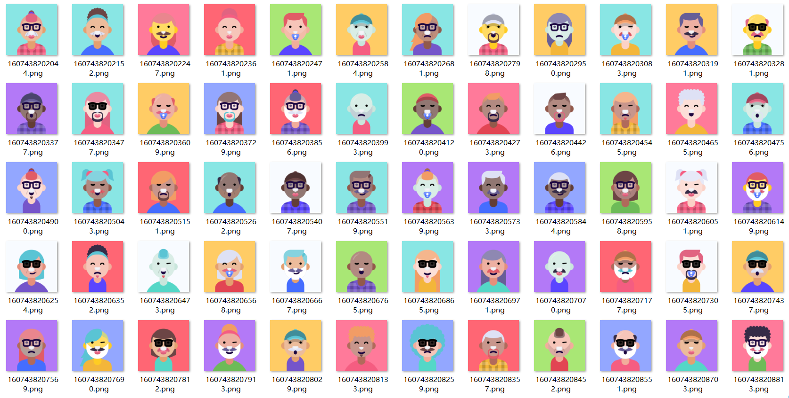

# 随机头像生成器
> 一个简单的随机头像生成工具，素材来自[https://personas.draftbit.com/](https://personas.draftbit.com/)

## 生成预览



## 示例

```javascript
const generate = require('./index');
const fs = require('fs');
generate().then(buffer => {
    fs.writeFileSync(`./${+new Date()}.png`, buffer);
}).catch(err => {
    console.log(err);
})
```
